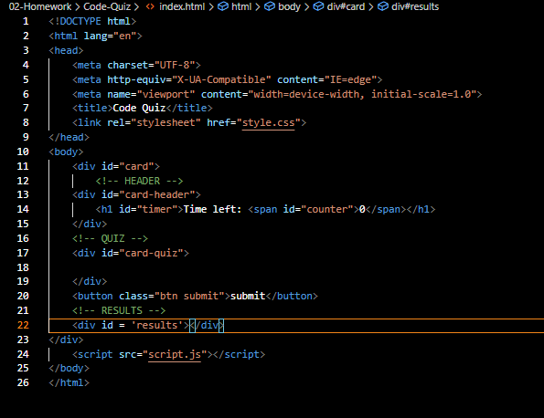

# <Code Quiz>

## Description

This program will generate an interactive quiz with multiple choices that will keep track of high scores.
This program will allow the user to keep his/her coding knowledge greased and compare it to others via scores.
It will be powered by Jquery and bootstrap.
WIth this project my aim is to learn:
    - Bootstrap
    - Jquery
    - Forms
    - Prompts, Confirm and Alerts
    - Local Storage
    - Creating and renderign a timer

By default, I created a style.css file when I initialized the repository. However, this might not be needed as I will be using bootstrap for styling purposes. I don´t anticipate using custom styling.
As such, I might delete the style.css file in a future commit.

## GitHub Repo
https://github.com/aj-pena/Code-Quiz.git

## Live Webpage
https://aj-pena.github.io/Code-Quiz/

## Workflow
FIRST, I will complete the index.html file.
I have completed the skeleton: 

SECOND, I will work on the JavaScript side of things.
THIRD, I will power the styling with custom CSS.
![alt text] (assets/images/photoname.png)

This aplication starts with an intro page:

Then continues into the questioning stage:

When questions are finished it will ask the user wether to save the score or clear history

If the user chooses to save, the highscores will be shown to the user

## Challenges
Local Storage
JSON.stringify
JSON.parse
Storing array of object in localStorage

## Lessons Learned

I can store an array of objects in one key of local Storage
I have to use JSON.stringify before storing the array in local Storage to convert it to string
I have to use JSON.parse when retrieving the array from local storage to convert it to array

## Tools List (For reference)
Possible methods I will use:

<!-- Accessing HTML -->

document.querySelector()
document.querySelectorAll()
variableOrElement.textContent = value;
variableOrObject.setAttribute('nameOf', value);
document.getElementByClass('className');
document.getElementById('idName');
variable = document.createElement();
document.body.appendChild(variableOrObject);

<!-- Local Storage -->

localStorage.getItem('nameOf');
localStorage.setItem('nameOf');

<!-- Event -->

event.preventDefault)();
event.stopPropagation();
event.currentTarget.setAttribute();

<!-- Attributes -->

object.setAttribute('style','key1: value1; key2: value2;');
array[numberOrIndex].setAttribute();

<!-- Prompt / Confirm / Alert -->

prompt();
confirm();
alert('String' or value);

<!-- Interval -->

variable setInterval();
clearInterval(intervalName);

<!-- JSON -->

JSON.parse();
JSON.stringify();

<!-- Example from web -->
check https://github.com/CodeExplainedRepo/Multiple-Choice-Quiz-JavaScript/blob/master/quiz.js
